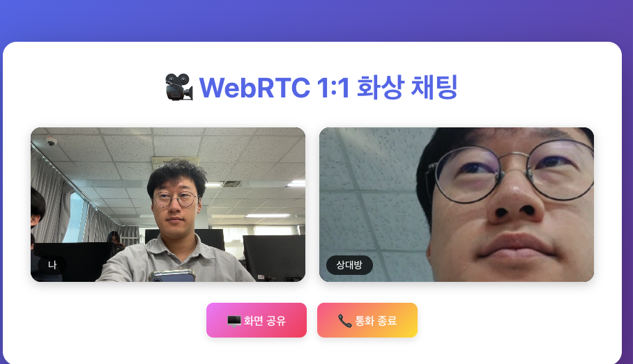

# 🎥 WebRTC 1:1 화상 채팅 서비스



React + Node.js 기반의 실시간 1:1 화상 채팅 애플리케이션입니다. WebRTC 기술을 활용하여 브라우저 간 직접적인 P2P 통신을 구현했습니다.

## 🚀 실행 방법

### 로컬 개발 환경

#### 1. Node.js 서버 실행

```bash
# server 디렉토리로 이동
cd server

# 의존성 설치
npm install

# 서버 실행
npm start

# 또는 개발 모드 (nodemon 사용)
npm run dev
```

서버는 기본적으로 `http://localhost:5001`에서 실행됩니다.

#### 2. React 프론트엔드 실행

새 터미널 창에서:

```bash
# client 디렉토리로 이동
cd client

# 의존성 설치
npm install

# 개발 서버 실행
npm start
```

프론트엔드는 기본적으로 `http://localhost:3000`에서 실행됩니다.

#### 3. 사용 방법

1. 브라우저에서 `http://localhost:3000` 접속
2. 같은 방 ID를 입력 (예: "room1")
3. 두 개의 브라우저 창/탭에서 같은 방 ID로 입장
4. 자동으로 WebRTC 연결이 설정되고 화상 통화 시작
5. 통화 중 "비디오 끄기/켜기", "오디오 끄기/켜기" 버튼으로 실시간 제어 가능
6. "화면 공유" 버튼을 클릭하여 화면 공유 가능

### ⚡ 빠른 시작 가이드

#### 어떤 URL을 사용해야 하나요?

| 실행 모드         | 접속 URL                | 설명                                   |
| ----------------- | ----------------------- | -------------------------------------- |
| **개발 모드**     | `http://localhost:3000` | React 개발 서버 사용 (Hot Reload 지원) |
| **프로덕션 모드** | `http://localhost:5001` | 빌드된 React 앱을 백엔드에서 서빙      |

#### 개발 모드 (권장 - 코드 수정 시)

```bash
# 터미널 1: 백엔드 서버
cd server
npm start

# 터미널 2: 프론트엔드 개발 서버
cd client
npm start
```

→ 브라우저에서 **`http://localhost:3000`** 접속

#### 프로덕션 모드 (빌드 후 실행)

```bash
# 1. React 앱 빌드
cd client
npm run build

# 2. 백엔드 서버 실행 (빌드 파일 포함)
cd ../server
npm start
```

→ 브라우저에서 **`http://localhost:5001`** 접속

> **참고**: 프로덕션 모드는 ngrok 사용 시 권장됩니다.

### 모바일/외부 접근 (ngrok 사용)

모바일 기기나 다른 네트워크에서 접근하려면 ngrok을 사용합니다.

#### 방법 1: 프론트엔드와 백엔드를 함께 서빙 (권장)

1. **React 앱 빌드**

```bash
cd client
npm run build
```

2. **백엔드 서버 실행** (프론트엔드 빌드 파일을 함께 서빙)

```bash
cd server
npm start
```

3. **ngrok으로 백엔드 포트(5001) 터널링**

```bash
ngrok http 5001
```

4. **ngrok URL로 접속**
   - ngrok이 제공하는 HTTPS URL (예: `https://xxxx-xx-xx-xx-xx.ngrok-free.dev`)로 접속
   - 같은 URL에서 프론트엔드와 백엔드 모두 접근 가능

#### 방법 2: 개발 모드 (프론트엔드와 백엔드 분리)

1. **백엔드 서버 실행**

```bash
cd server
npm start
```

2. **백엔드 ngrok 터널링** (새 터미널)

```bash
ngrok http 5001
```

백엔드 ngrok URL을 복사 (예: `https://backend-xxxx.ngrok-free.dev`)

3. **프론트엔드 실행** (새 터미널)

```bash
cd client
REACT_APP_SERVER_URL=https://backend-xxxx.ngrok-free.dev npm start
```

4. **프론트엔드 ngrok 터널링** (새 터미널)

```bash
ngrok http 3000
```

5. **프론트엔드 ngrok URL로 접속**

> **참고**: ngrok 무료 계정은 하나의 동시 터널만 허용합니다. 방법 1을 권장합니다.

## ✨ 주요 기능

- ✅ 1:1 실시간 화상 통화
- ✅ 실시간 음성 통신
- ✅ 비디오/오디오 켜기/끄기 (통화 중 실시간 제어)
- ✅ 화면 공유 기능
- ✅ Socket.io 기반 Signaling 서버
- ✅ STUN/TURN 서버를 통한 NAT 통과 (모바일 LTE 지원)
- ✅ ngrok을 통한 외부 접근 지원
- ✅ 반응형 디자인

## 🏗️ 프로젝트 구조

```
1207-team-webrtc-videdo-chat/
├── client/                 # React 프론트엔드
│   ├── public/
│   ├── src/
│   │   ├── App.js         # 메인 컴포넌트
│   │   ├── App.css        # 스타일
│   │   └── index.js       # 진입점
│   └── package.json
├── server/                 # Node.js 시그널링 서버
│   ├── server.js          # Socket.io 서버
│   └── package.json
└── README.md
```

## 🔧 기술 스택

### Frontend

- **React 18**: UI 프레임워크
- **Socket.io Client**: 시그널링을 위한 WebSocket 통신
- **WebRTC API**:
  - `getUserMedia`: 로컬 미디어 스트림 획득
  - `getDisplayMedia`: 화면 공유 스트림 획득
  - `RTCPeerConnection`: P2P 연결 관리
  - `RTCSessionDescription`: Offer/Answer 교환
  - `RTCIceCandidate`: ICE 후보 교환

### Backend

- **Node.js**: 서버 런타임
- **Express**: HTTP 서버
- **Socket.io**: WebSocket 기반 시그널링 서버
- **CORS**: Cross-Origin 리소스 공유

## 🔧 환경 변수 설정

### 프론트엔드 (client)

- `REACT_APP_SERVER_URL`: 백엔드 서버 URL (기본값: `http://localhost:5001`)
  - ngrok 사용 시: `REACT_APP_SERVER_URL=https://your-backend-ngrok-url.ngrok-free.dev npm start`
- `REACT_APP_TURN_SERVER`: 커스텀 TURN 서버 URL (선택사항)
- `REACT_APP_TURN_USERNAME`: TURN 서버 사용자명 (선택사항)
- `REACT_APP_TURN_CREDENTIAL`: TURN 서버 비밀번호 (선택사항)

### 백엔드 (server)

- `PORT`: 서버 포트 (기본값: `5001`)
- `FRONTEND_URL`: 프론트엔드 URL (CORS 설정용, 선택사항)

## 📚 WebRTC 동작 원리

### 1. Signaling (시그널링)

- WebRTC는 직접적인 P2P 연결을 위해 시그널링 서버가 필요합니다
- Socket.io를 사용하여 Offer, Answer, ICE Candidate를 교환합니다

### 2. STUN/TURN 서버

- **STUN 서버**: NAT(Network Address Translation) 뒤에 있는 클라이언트의 공인 IP를 확인합니다
  - Google의 공개 STUN 서버 사용: `stun:stun.l.google.com:19302`
- **TURN 서버**: STUN만으로 연결이 안 되는 경우(모바일 LTE 등) 트래픽을 릴레이합니다
  - 기본적으로 Metered.ca의 무료 TURN 서버 사용
  - 프로덕션 환경에서는 유료 TURN 서비스(Twilio, Cloudflare 등) 사용 권장

### 3. 연결 흐름

```
1. 사용자 A가 방에 입장
2. 사용자 B가 같은 방에 입장
3. 사용자 A가 Offer 생성 및 전송
4. 사용자 B가 Answer 생성 및 전송
5. 양쪽에서 ICE Candidate 교환
6. P2P 연결 수립 완료
7. 미디어 스트림 전송 시작
```

### 4. 화면 공유

- 별도의 PeerConnection을 생성하여 화면 공유 스트림을 전송합니다
- `getDisplayMedia` API를 사용하여 화면 캡처

### 5. 비디오/오디오 제어

- 통화 중 실시간으로 비디오와 오디오를 켜고 끌 수 있습니다
- MediaStreamTrack의 `enabled` 속성을 토글하여 즉시 반영됩니다
- PeerConnection 재협상 없이 동작하여 효율적입니다

## 🎯 주요 구현 내용

### MediaStream 관리

- 로컬 비디오/오디오 스트림 획득 및 표시
- 원격 스트림 수신 및 표시
- 화면 공유 스트림 별도 관리
- 통화 중 비디오/오디오 실시간 제어 (켜기/끄기)

### RTCPeerConnection

- Peer-to-Peer 연결 생성 및 관리
- Offer/Answer 교환을 통한 SDP 협상
- ICE Candidate 교환을 통한 최적 경로 탐색

### RTCDataChannel (향후 확장 가능)

- 현재는 미디어 스트림만 사용
- 텍스트 채팅, 파일 전송 등에 활용 가능

## ⚠️ 주의사항

1. **HTTPS 또는 localhost**:

   - `getUserMedia`와 `getDisplayMedia`는 보안상 HTTPS 환경 또는 localhost에서만 동작합니다
   - ngrok을 사용하면 자동으로 HTTPS가 제공됩니다
   - 프로덕션 배포 시 HTTPS가 필요합니다

2. **브라우저 호환성**:

   - Chrome, Firefox, Edge 등 최신 브라우저에서 동작합니다
   - Safari는 일부 제한이 있을 수 있습니다
   - 모바일 브라우저도 지원합니다 (TURN 서버 덕분)

3. **방화벽/NAT**:

   - WiFi 네트워크에서는 STUN만으로도 연결이 가능합니다
   - 모바일 LTE 네트워크에서는 TURN 서버가 필요합니다 (이미 설정됨)
   - 프로덕션 환경에서는 안정적인 유료 TURN 서비스 사용 권장

4. **카메라/마이크 권한**:

   - 브라우저에서 카메라와 마이크 접근 권한을 허용해야 합니다
   - 모바일에서는 브라우저 설정에서 권한을 확인하세요

5. **ngrok 사용 시**:
   - ngrok 무료 계정은 하나의 동시 터널만 허용합니다
   - 프론트엔드와 백엔드를 같은 포트에서 서빙하는 방법을 권장합니다
   - ngrok URL은 재시작 시 변경될 수 있습니다

## 🔮 향후 개선 사항

- [x] TURN 서버 연동 (NAT 통과 개선) ✅
- [x] ngrok을 통한 외부 접근 지원 ✅
- [x] 음소거/비디오 끄기 토글 ✅
- [ ] 텍스트 채팅 기능 추가
- [ ] 다중 사용자 지원 (1:N 화상 회의)
- [ ] 화면 녹화 기능
- [ ] 연결 상태 표시
- [ ] 에러 핸들링 개선
- [ ] 커스텀 TURN 서버 설정 가이드

## 📝 라이선스

MIT License

## 👥 팀 프로젝트

이 프로젝트는 WebRTC 기술 학습 및 실전 구현을 위한 팀 프로젝트입니다.

---

**만든이**: WebRTC 팀 프로젝트  
**과제**: React + Node.js 기반 WebRTC 실시간 통신 서비스 구현
